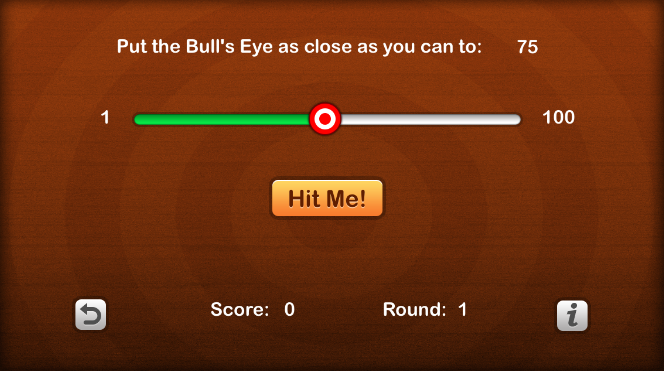
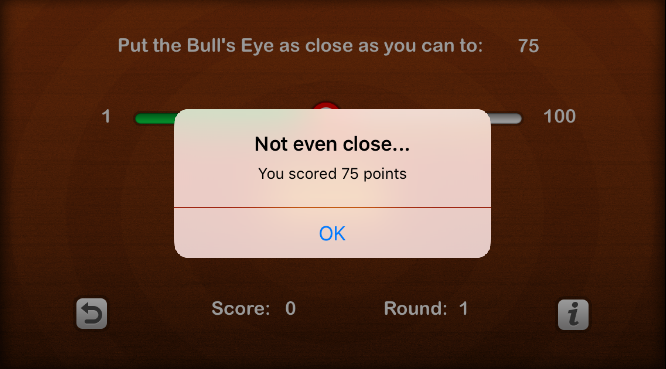
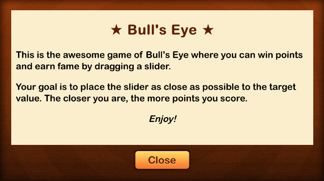

# iOS-BullsEye-Game
iOS Bulls Eye Game built in Swift. 

#How the game works
A random number is generated at the beginning of every new game. The slider can be changed to represent a number between 0 and 100. Your aim is to move the slider closest to the random number as possible. See screenshots below.

#Screenshots

